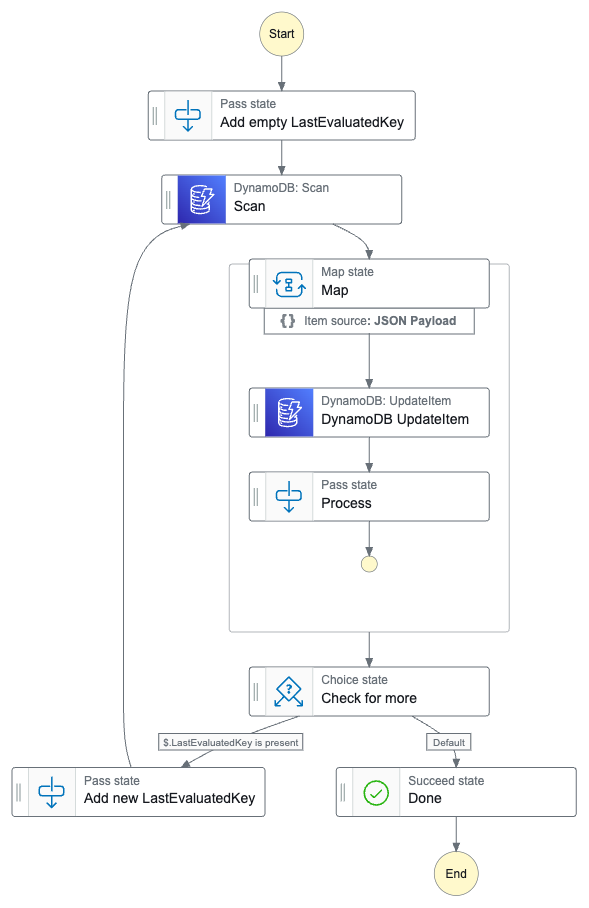
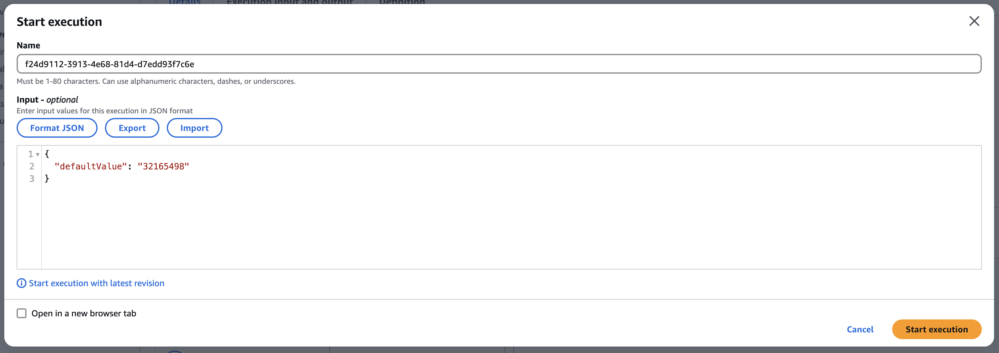

## example-update-ddb-add-attribute-with-sfn

This repository provides a simple example of using AWS Step Functions to scan a DynamoDB table and add an attribute to all items without the need for custom code in Lambda or containers. This approach is particularly useful when defining a TTL attribute for previously created items.




This example is written in terraform. To get started you will need the table name you want to update and the key attribute name

```

variable "table_to_update" {
  type = object({
    name               = string
    key_attribute_name = string
  })
}


```


When running the step function you will need to provide the name of the attribute you want to add/update with its default value.

